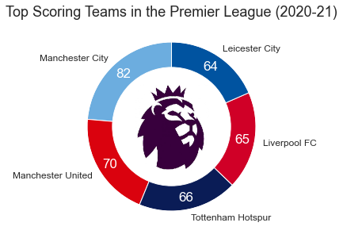
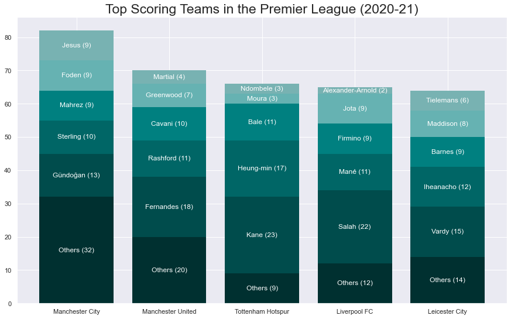
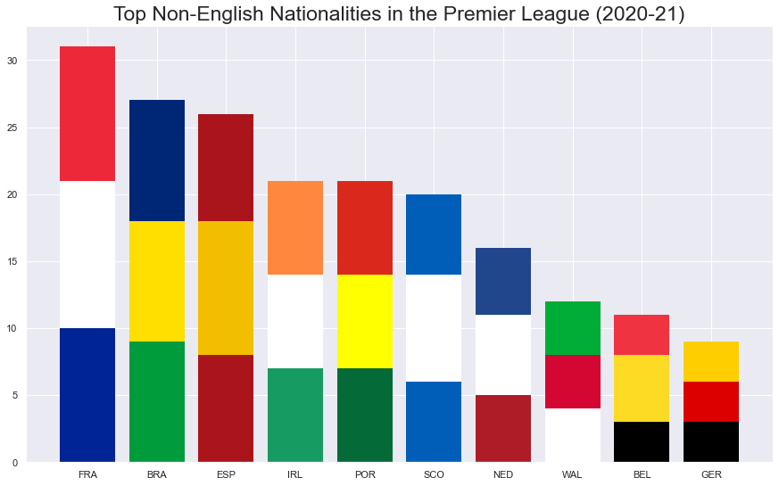

# EnglishPremierLeague20_21

This is an Exploratory Data Analysis (EDA) project working on the [English Premier League(2020-21)](https://www.kaggle.com/rajatrc1705/english-premier-league202021) dataset on [Kaggle](https://www.kaggle.com/).

## Installation

Use the package manager [pip](https://pip.pypa.io/en/stable/) to install the packages needed.

*note: ```matplotlib 3.4+``` is needed which requires ```python 3.7```+*

```bash
pip install requirements.txt
```

## Generated Plots
<div class="image123">
    <div class="imgContainer">
    <p align="center">
        
    </p>
    </div>
    <div class="imgContainer">
    <p align="center">
        
    </p>
    </div>
    <div class="imgContainer">
    <p align="center">
        
    </p>
    </div>
</div>

## License

[MIT](https://choosealicense.com/licenses/mit/)
